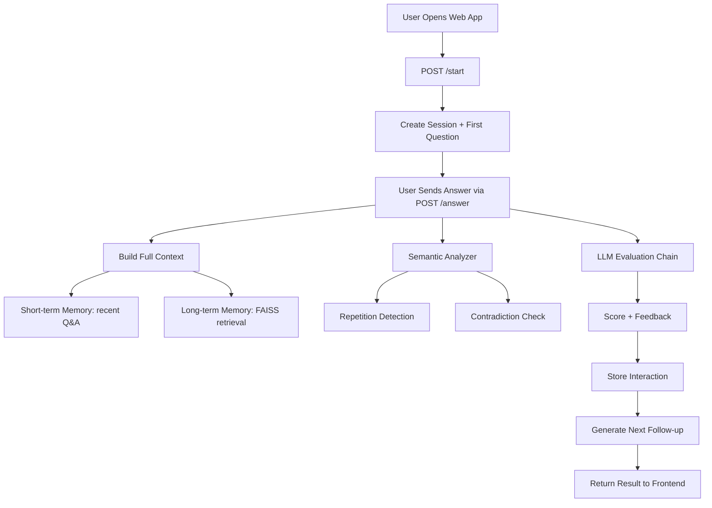

# Context-Aware AI Interview System

## Overview
This project is a full-stack AI interview app that asks follow-up questions, evaluates answers, and keeps conversational memory across an interview session.

## Core Features
- Context-aware follow-up questions using prior Q&A.
- Hybrid memory: short-term history + FAISS semantic retrieval.
- Answer evaluation with score and feedback.
- Repetition detection via embedding similarity.
- Contradiction checks against earlier responses.
- Web interface served by FastAPI.

## Tech Stack
- Backend: Python, FastAPI, Uvicorn
- LLM Orchestration: LangChain, Groq
- Embeddings and Semantic Search: SentenceTransformers, FAISS
- Frontend: HTML, CSS, JavaScript

## Tech Flow Diagram

## Project Structure
- backend/: API, memory, analyzer, and LLM chain modules
- frontend/: static UI files
- requirements.txt: dependencies

## DO Checkout the Demo run of project
Demo video: [Open video file](running%20demo.mp4) | [Open raw video](running%20demo.mp4?raw=1)
If GitHub preview does not play, use the raw link to stream or download in your browser.
Notebook: [UPTOSKILL_task2_nootbook.ipynb](UPTOSKILL_task2_nootbook.ipynb)

## How To Run
1. Open terminal in project root.
2. Create and activate a virtual environment.
3. Install dependencies:
   pip install -r requirements.txt
4. Add your Groq key in .env:
   GROQ_API_KEY=your_key_here
5. Start server from project root:
   uvicorn backend.main:app --reload --port 8000
6. Open:
   http://127.0.0.1:8000

## API Endpoints
- POST /start: starts a new interview session
- POST /answer: submits answer and returns score, feedback, and next question
- GET /docs: Swagger API docs

## Notes
- Run from project root, not from backend/.
- If evaluation fallback appears, check backend logs for LLM/parser errors.
